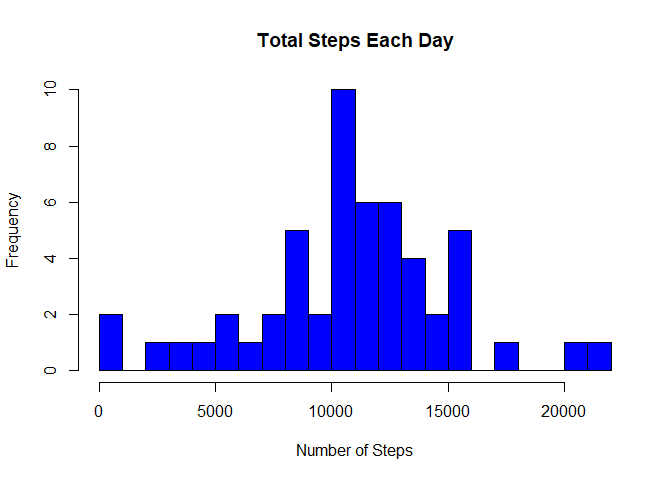
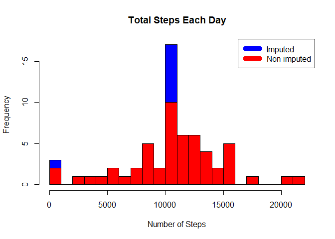

###About
This was the first project for the **Reproducible Research** course in [Coursera's Data Science specialization](https://www.coursera.org/learn/reproducible-research/home/welcome)  track. 
The purpose of this project was to answer a series of questions using data collected from a [FitBit](http://en.wikipedia.org/wiki/Fitbit).


##Synopsis
The purpose of this project was to practice:

* downloading, loading and preprocessing data
* imputing missing values
* interpreting data to answer research questions

## Data
The data for this assignment was downloaded from the course web site:

* Dataset: [Activity monitoring data](https://d396qusza40orc.cloudfront.net/repdata%2Fdata%2Factivity.zip) [52K]

The variables included in this dataset are:

* **steps**: Number of steps taking in a 5-minute interval (missing values are coded as `NA`)

* **date**: The date on which the measurement was taken in YYYY-MM-DD format (YYYY for year, MM for month, DD for day)

* **interval**: Identifier for the 5-minute interval in which measurement was taken

The dataset is stored in a comma-separated-value (CSV) file and there are a total of 17,568 observations in this dataset.

## downloading, loading and preprocessing the data

Download, unzip and load data into data frame `data`. 

```r
if(!file.exists("getdata-projectfiles-UCI HAR Dataset.zip")) {
    if(!dir.exists('data')){dir.create('data')}
    data.zip <- 'data/repdata-data-activity.zip';
    download.file("http://d396qusza40orc.cloudfront.net/repdata%2Fdata%2Factivity.zip",data.zip)
    unzip(data.zip, exdir = 'data')
    unlink(data.zip)
}

if("data.table" %in% rownames(installed.packages()) == FALSE) {install.packages("data.table")}
library(data.table);

if("lubridate" %in% rownames(installed.packages()) == FALSE) {install.packages("lubridate")}
library(lubridate)
```

```
## 
## Attaching package: 'lubridate'
```

```
## The following objects are masked from 'package:data.table':
## 
##     hour, isoweek, mday, minute, month, quarter, second, wday,
##     week, yday, year
```

```
## The following object is masked from 'package:base':
## 
##     date
```

```r
data <- fread("data/activity.csv")
```


## What is mean total number of steps taken per day?
Sum steps by day, create Histogram, and calculate mean and median.

```r
steps_by_day <- aggregate(steps ~ date, data, sum);
summary(steps_by_day);
```

```
##      date               steps      
##  Length:53          Min.   :   41  
##  Class :character   1st Qu.: 8841  
##  Mode  :character   Median :10765  
##                     Mean   :10766  
##                     3rd Qu.:13294  
##                     Max.   :21194
```

```r
hist(steps_by_day$steps, main = paste("Total Steps Each Day"), col="blue", xlab="Number of Steps", breaks = 16);
```

<!-- -->

```r
rmean <- mean(steps_by_day$steps);
rmedian <- median(steps_by_day$steps);
a <- sprintf("The mean is %3.1f and median is %3.1f", rmean, rmedian)
```
The mean is 10766.2 and median is 10765.0

## What is the average daily activity pattern?

* Calculate average steps for each interval for all days. 
* Plot the average number steps per day by interval. 
* Find interval with most average steps. 


```r
steps_by_interval <- aggregate(steps ~ interval, data, mean)

plot(steps_by_interval$interval, steps_by_interval$steps, 
     type="l", xlab="Interval", ylab="Number of Steps",
     main="Average Number of Steps per Day by Interval")
```

<!-- -->

```r
max_interval <- steps_by_interval[which.max(steps_by_interval$steps),1]
```


The 5-minute interval, on average across all the days in the data set, containing the maximum number of steps is 835.


## Impute missing values. Compare imputed to non-imputed data.
Missing data needed to be imputed. 
Only a simple imputation approach was required for this assignment. 
Missing values were imputed by inserting the average for each interval. Thus, if interval 10 was missing on 10-02-2012, the average for that interval for all days (0.1320755), replaced the NA. 


```r
q.incomplete <- sum(!complete.cases(data))
imputed_data <- transform(data, steps = ifelse(is.na(data$steps), steps_by_interval$steps[match(data$interval, steps_by_interval$interval)], data$steps))
```

Zeroes were imputed for 10-01-2012 because it was the first day and would have been over 9,000 steps higher than the following day, which had only 126 steps. NAs then were assumed to be zeros to fit the rising trend of the data. 


```r
imputed_data[as.character(imputed_data$date) == "2012-10-01", 1] <- 0
```

Recount total steps by day and create Histogram. 


```r
steps_by_day_i <- aggregate(steps ~ date, imputed_data, sum)
hist(steps_by_day_i$steps, main = paste("Total Steps Each Day"), col="blue", xlab="Number of Steps", breaks = 16)

#Create Histogram to show difference. 
hist(steps_by_day$steps, main = paste("Total Steps Each Day"), col="red", xlab="Number of Steps", add=T, breaks = 16)
legend("topright", c("Imputed", "Non-imputed"), col=c("blue", "red"), lwd=10)
```

<!-- -->

Calculate new mean and median for imputed data. 

```r
rmean.i <- mean(steps_by_day_i$steps)
rmedian.i <- median(steps_by_day_i$steps)
```

Calculate difference between imputed and non-imputed data.

```r
mean_diff <- rmean.i - rmean
med_diff <- rmedian.i - rmedian
```

Calculate total difference.

```r
total_diff <- sum(steps_by_day_i$steps) - sum(steps_by_day$steps)
```
* The imputed data mean is 10,589.69
* The imputed data median is 10,766.19
* The difference between the non-imputed mean and imputed mean is -176.4949
* The difference between the non-imputed mean and imputed mean is 1.188679
* The difference between total number of steps between imputed and non-imputed data is 75363.3. Thus, there were 75,363.32 more steps in the imputed data.


## Are there differences in activity patterns between weekdays and weekends?
Created a plot to compare and contrast number of steps between the week and weekend. There is a higher peak earlier on weekdays, and more overall activity on weekends.  

```r
weekdays <- c(2, 3, 4, 5, 6); 
imputed_data$dow = as.factor(ifelse(is.element(wday(as.Date(imputed_data$date)),weekdays), "Weekday", "Weekend"))

steps_by_interval_i <- aggregate(steps ~ interval + dow, imputed_data, mean)

library(lattice)

xyplot(steps_by_interval_i$steps ~ steps_by_interval_i$interval |steps_by_interval_i$dow, main="Average Steps per Day by Interval",xlab="Interval", ylab="Steps",layout=c(1,2), type="l")
```

<!-- -->
